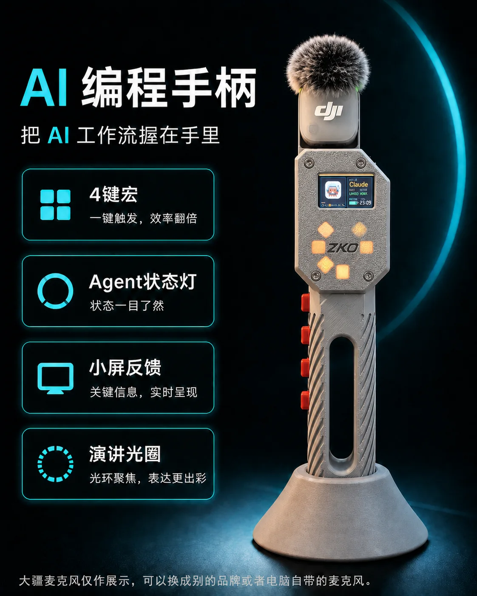
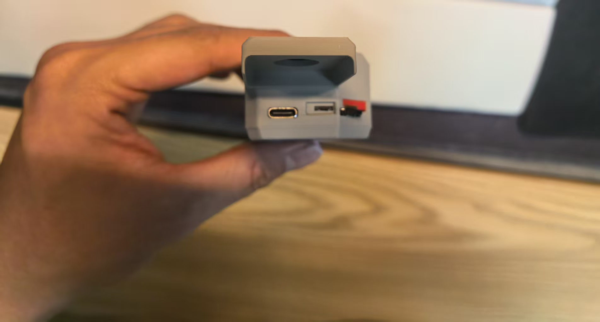
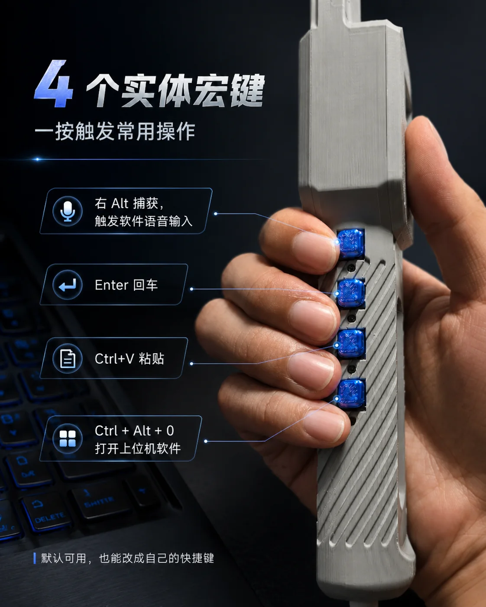
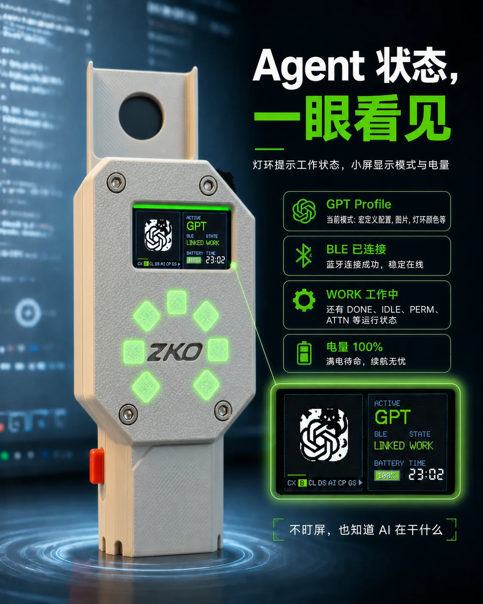
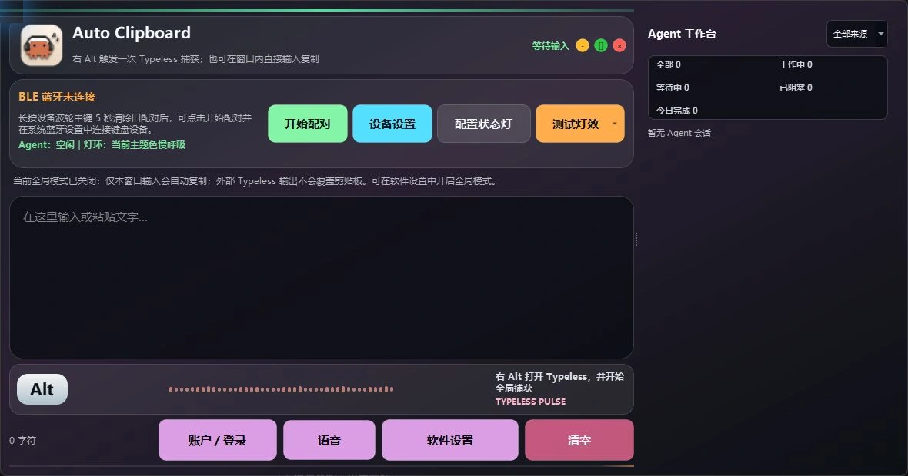
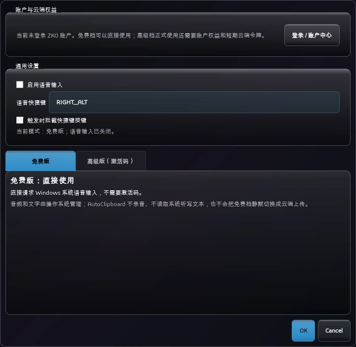
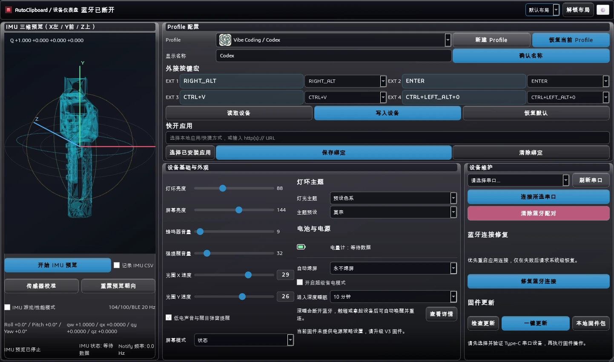

**简体中文** | [English](README.en.md)

<!-- section:s001 -->
# 字库 · AI 编程手柄

> 写代码，不用再低头找快捷键。

字库 AI 编程手柄把 4 枚可编程宏按键、彩色小屏、Agent 状态灯环、蓝牙键盘、姿态感应和 AutoClipboard 桌面软件结合在一起，适合 AI 编程、语音输入、Codex、Claude Code、演讲展示等需要保持专注的工作流。

<p align="center">
  
</p>

> 图片中的 DJI 麦克风仅作为使用场景和可替换配件展示，不包含在手柄包装内。

本仓库是 AutoClipboard、手柄固件、驱动程序、公开文档和开源 AI Coding Handle Skill 的正式下载入口。

<!-- section:s002 -->
## 下载源：优先 GitHub，国内网络自动回退 Gitee

GitHub 仍然是主要发布源。如果所在网络访问 GitHub 很慢、超时或无法连接，可以使用面向中国大陆网络的 Gitee 镜像。两个发布源提供相同的安装包、固件和完整性校验信息。

| 下载源 | 适用情况 | 下载入口 |
| --- | --- | --- |
| GitHub | 默认首选，正常网络环境优先使用 | [GitHub 最新 Release](https://github.com/Lijinzh/Communist-Manifesto-Releases/releases/latest) |
| Gitee | GitHub 访问不稳定、下载超时或无法连接时使用 | [Gitee 发布页](https://gitee.com/shan-yujun/Communist-Manifesto-Releases/releases) |

AutoClipboard 的软件更新与固件更新会先尝试 GitHub；GitHub 不可用时，自动改用 Gitee 重新获取更新。无论文件来自哪个源，安装前都会继续核对文件大小和 SHA-256 校验值，不会因为启用备用源而跳过安全校验。

### `v0.3.76` Windows / Linux / macOS 三平台发布

`v0.3.76` 提供 Windows x64 EXE、Linux amd64 DEB、macOS Apple Silicon 未公证预览 DMG
和 AI Coding Handle Skill，三端安装包均从主仓库同一提交
`c15d0c11b47f738cfa8e03024af2e52abb41354e` 原生构建。该版本加入高级语音多场景润色、
个人热词和录音启动预缓冲，完善 Profile 专属手柄控制、相对鼠标移动、账户缓存与头像同步、
独立非模态设置窗口和多套像素主题，并修复 ASR 停止、文本落框、macOS 模型资源及 Linux
桌面入口问题。V3 固件继续携带已完成 validated app-only 与 BLE/IMU 实机验证的 `0.3.68`，
D4 已停止维护。

macOS 包面向 arm64，使用 ad-hoc 签名且未经 Apple 公证；首次安装后需执行
`xattr -cr /Applications/AutoClipboard.app`，不得将其视为已通过 Gatekeeper 的 Developer ID 包。

完整更新内容、校验值和发布范围见 [`v0.3.76` 发布说明](docs/zh-CN/maintainers/releases/v0.3.76.md)。

<!-- section:s003 -->
## 首先推荐：让 Codex 一句话完成配置

如果你正在使用 Codex，建议在手动配置之前先安装官方结构的 **ZKO 字库一键配置插件**。它内置 `ai-coding-handle` Skill，可以选择并安装合适的 AutoClipboard、配置受支持的 Agent 状态 Hook、识别 D4/V3 硬件，并以只读方式检查 USB、串口、蓝牙和软件状态。

中国大陆网络优先从 Gitee 添加 ZKO Marketplace：

```bash
codex plugin marketplace add https://gitee.com/shan-yujun/Communist-Manifesto-Releases.git
codex plugin add zko-ai-coding-handle@zko-lab
```

如果 Gitee Git 不可用，改用 GitHub 添加同一个 Marketplace：

```bash
codex plugin marketplace add Lijinzh/Communist-Manifesto-Releases
codex plugin add zko-ai-coding-handle@zko-lab
```

安装完成后新建一个 Codex 任务，再调用 `$ai-coding-handle`。Claude Code、Cursor、OpenCode 和其他支持 Agent Skills 的客户端可使用通用安装方式：

```bash
npx skills add https://gitee.com/shan-yujun/Communist-Manifesto-Releases.git --skill ai-coding-handle --agent '*' -g -y --copy
```

如果 Gitee Git 不可用，把来源替换成 `Lijinzh/Communist-Manifesto-Releases` 即可从 GitHub 安装。

也可以直接把下面这段话发给大模型：

> 请优先从 Gitee 的 `shan-yujun/Communist-Manifesto-Releases` 安装 `zko-ai-coding-handle` Codex 插件；如果当前 Agent 不支持 Codex 插件，就从 GitHub 的 `Lijinzh/Communist-Manifesto-Releases` 安装 `ai-coding-handle` Skill。安装后帮我安装或检查 AutoClipboard、识别字库 D4/V3、配置当前 Agent Hook 和按键；涉及系统设置、驱动或固件写入前先向我确认。

Skill 可以自动完成检查，但不会静默重置系统蓝牙或擅自刷写固件。任何固件更新仍然需要针对当前设备和更新方案进行单独、明确的确认。

没有可用的大模型客户端也没有关系，可以继续按照下面的手动步骤操作，或直接阅读[完整中文使用说明书](docs/zh-CN/user-guide.md)。

<!-- section:s004 -->
## 5 分钟完成首次使用

1. **使用 Skill 安装，或手动下载 AutoClipboard。** Windows 是当前主要支持平台；请优先从 [GitHub 最新 Release](https://github.com/Lijinzh/Communist-Manifesto-Releases/releases/latest)下载与你的系统相符的安装包。如果 GitHub 无法访问，请改用 [Gitee 国内备用发布页](https://gitee.com/shan-yujun/Communist-Manifesto-Releases/releases)。
2. **先给手柄充电。** 使用合适的线缆连接 USB Type-C 接口。串口诊断和固件更新必须使用支持数据传输的线，只有充电功能的线无法完成这些操作。
3. **打开或唤醒手柄。** 全新设备或已经清除配对的设备会开放 120 秒蓝牙配对窗口。
4. **连接正确的蓝牙设备。** 在系统蓝牙设置中选择完整名称 `CommunistKB-XXXX`。末尾 4 位编号由手柄自动生成，用户不需要自己输入或追加后缀。
5. **启动 AutoClipboard，并让它在后台运行。** 基础蓝牙键盘宏可以脱离软件使用；Agent 状态、小屏时间、IMU 预览、深度配置和 Profile 快开需要 AutoClipboard。
6. **测试操作。** 上下拨动波轮切换 Profile，按一下宏按键，再双击波轮中键进入 `Settings`。

需要查看图片、连接多台电脑、了解 Profile 或排查问题时，请继续阅读[完整中文使用说明书](docs/zh-CN/user-guide.md)。

<!-- section:s005 -->
## 认识手柄硬件

<p align="center">
  
</p>

照片左侧的 USB Type-C 接口用于充电、串口通信、图标传输、设备诊断和固件更新。日常使用只需要按照说明连接 Type-C 接口；旁边可见的板上部件不属于普通用户需要操作的日常接口。

| 部件 | 作用 |
| --- | --- |
| USB Type-C 接口 | 充电；使用数据线进行串口诊断和固件更新 |
| 1.14 英寸彩色小屏 | 显示 Profile、蓝牙状态、电量、时间、Agent 状态和设备提示 |
| 波轮和中键 | 切换 Profile、移动菜单、确认选项，以及进入或退出设置 |
| 侧面 4 枚宏按键 | 执行当前 Profile 中保存的快捷键宏 |
| 正面灯环 | 显示 Agent 状态、Profile、输入反馈和警告提示 |
| 内置 IMU 姿态传感器 | 用于三维姿态预览和演讲光圈 |

<p align="center">
  
</p>

默认的 Vibe Coding Profile 将四枚按键设置为 `Right Alt`、`Enter`、`Ctrl+V` 和 `Ctrl+Alt+0`。这四个按键都可以在 AutoClipboard 中重新配置。

<!-- section:s006 -->
## 蓝牙名称与配对

当前固件的蓝牙广播名称固定为：

```text
CommunistKB-XXXX
```

`XXXX` 是 ESP32 MAC 地址最后 2 个字节生成的 4 位大写十六进制编号。例如某台手柄可能显示为 `CommunistKB-A216`。这个编号已经包含在系统扫描到的完整名称中，用户不需要自己添加后缀。

<!-- section:s007 -->
### 第一次配对

1. 打开 Windows、Linux 或 macOS 的蓝牙设置，选择“添加设备”。
2. 打开或唤醒手柄。
3. 等待小屏显示 `PAIR`。
4. 在电脑上选择完整的 `CommunistKB-XXXX` 名称。
5. 配对完成并建立连接后，小屏会显示 `LINK`。

<!-- section:s008 -->
### 连接第二台或第三台电脑

1. 双击波轮中键进入 `Settings`。
2. 拨动到 `BLE Hosts`，单击进入。
3. 选择一个 `EMPTY` 空槽位并单击。
4. 看到 `PAIR` 后，在新电脑的蓝牙设置中添加 `CommunistKB-XXXX`。

手柄可以保存 3 个主机槽位。在 `BLE Hosts` 页面中，单击已有槽位可以切换到该电脑，长按已有槽位可以删除该主机记录。

<!-- section:s009 -->
## 波轮与小屏操作

<!-- section:s010 -->
### 在正常状态页

| 操作 | 结果 |
| --- | --- |
| 向上或向下拨动 | 切换上一个或下一个 Profile |
| 单击中键 | 打开当前 Profile 绑定的应用、快捷方式或网页；需要 AutoClipboard 在后台运行 |
| 双击中键 | 进入 `Settings` |
| 长按中键 | 也可以进入 `Settings` |

<!-- section:s011 -->
### 在 Settings 设置界面

| 操作 | 结果 |
| --- | --- |
| 向上或向下拨动 | 移动选项；编辑时调整数值 |
| 单击中键 | 进入、开始编辑、确认或保存当前项目 |
| 长按中键 | 取消编辑、返回上一级或退出设置 |

不要尝试“按住中键同时拨动波轮”。机械结构不支持这种组合动作，蓝牙主机切换也不使用这种操作。

<!-- section:s012 -->
## 看懂小屏与 Agent 状态灯

<p align="center">
  
</p>

上图用于展示整体视觉效果；当前固件的小屏蓝牙状态以以下短文字为准：

| 小屏文字 | 含义 |
| --- | --- |
| `LINK` | 已经连接当前选中的电脑 |
| `WAIT` | 正在等待已保存的电脑重新连接 |
| `PAIR` | 已临时开放，可以添加新的蓝牙主机 |

小屏还会显示当前 Profile、电量、时间、设备状态和正在工作的 Agent 数量。灯环可以反馈空闲、工作中、需要注意、等待授权、阻塞和完成等状态。Agent 状态同步需要 AutoClipboard 和已经配置好的 Agent Hook/Bridge。

<!-- section:s013 -->
## AutoClipboard 桌面软件

AutoClipboard 是手柄的配套桌面软件，可以显示当前连接的蓝牙设备，配置 Profile 名称和图标，录制宏按键，调整小屏、灯环、蜂鸣器与电源策略，查看 IMU 三维姿态，配置演讲光圈，并提供 Agent 工作台、模型用量查询、账户入口、免费/高级语音输入、软件自动更新和受控固件维护流程。

<p align="center">
  
</p>

<p align="center">
  
</p>

<p align="center">
  
</p>

这里展示的是 AutoClipboard `0.3.67` 当前源码渲染出的真实界面，不是文生图界面。截图使用隔离的干净设置和脱敏演示设备名，不包含个人账户、Agent 会话、真实蓝牙后缀或串口标识，因此会出现未登录、空 Agent、`CommunistKB-XXXX` 等安全演示状态。需要查看编号分区图、逐个控件的作用，以及“只改软件”和“会写入硬件”的明确区别，请阅读 [AutoClipboard 软件界面详细说明书](docs/zh-CN/software-interface-manual.md)。使用 Agent 状态同步、Profile 快开、IMU 预览、语音输入或演讲光圈时，请让 AutoClipboard 保持后台运行。

<!-- section:s014 -->
## 下载文件

打开[最新 GitHub Release](https://github.com/Lijinzh/Communist-Manifesto-Releases/releases/latest)，根据系统或用途选择文件：

| 用途 | 文件名格式 |
| --- | --- |
| Windows 软件 | `AutoClipboardSetup-<version>.exe` |
| Windows CH343 USB 串口驱动 | `CH343SER.EXE` |
| Linux / Ubuntu 软件 | `auto-clipboard_<version>_<arch>.deb` |
| 该版本提供 macOS 包时 | `AutoClipboard-<version>-macOS.dmg` |
| Apple Silicon 未公证预览包 | `AutoClipboard-<version>-macOS-unnotarized-preview.dmg` |
| 当前 V3 手柄固件 | `CommunistManifestoKB-firmware-v3-<version>.zip` |
| AI Coding Handle Skill 压缩包 | `ai-coding-handle-skill-<version>.zip` |

V3 是当前持续维护的硬件版本。不要给设备刷入其他板型的固件。如果不能确定板型，请先让 Skill 识别设备，再下载或更新固件。

### macOS 未公证预览版安装

当前预览 DMG 面向 Apple Silicon（M1/M2/M3/M4 等 arm64）Mac，使用 ad-hoc 签名，尚未完成 Apple 公证。安装步骤：

1. 下载 `AutoClipboard-<version>-macOS-unnotarized-preview.dmg`，并与 Release 页面公布的 SHA-256 核对。
2. 双击打开 DMG，把 `AutoClipboard.app` 拖入 `Applications`。
3. 打开“终端”，运行：

   ```bash
   xattr -cr /Applications/AutoClipboard.app
   ```

4. 从“应用程序”打开 AutoClipboard；首次使用时按系统提示授予辅助功能、输入监控或麦克风权限。

该命令只清除 AutoClipboard 应用包的下载隔离属性，不会关闭系统全局 Gatekeeper。只应对从本仓库官方 Release 下载并核对过 SHA-256 的应用执行。Intel Mac 不能使用 arm64 预览包，需要单独的 x86_64 构建。取得 Apple Developer ID 后，正式 macOS 包仍会恢复 Developer ID 签名、公证和 stapling，届时无需运行 `xattr`。

<!-- section:s015 -->
## 快速排障

- **系统里找不到 `CommunistKB-XXXX`：** 唤醒手柄，双击波轮进入 `Settings > BLE Hosts`，选择 `EMPTY`，等小屏出现 `PAIR` 后重新扫描。
- **Ubuntu 只显示无名 HID 地址：** 使用 `bluetoothctl` 确认当前扫描中只有一个候选，其 MAC 后缀与独立记录一致，并同时暴露 HID `0x1812` 和 Battery `0x180F` 后，才能按地址配对。这只是受影响 BlueZ 系统的兜底方式，不能替代完整名称进入主广播的固件修复。
- **系统已经配对，但 AutoClipboard 没有就绪：** 保持手柄唤醒，启动 AutoClipboard，再让 Skill 执行只读的 `inventory` 和 `doctor` 检查。
- **宏按键能用，但没有 Agent 状态：** 说明蓝牙键盘连接已经正常；还需要配置 Agent Hook/Bridge，并保持 AutoClipboard 运行。
- **Type-C 连接后没有 COM 端口：** 更换支持数据的线缆和 USB 接口，并查看[CH343 Windows 驱动安装指南](docs/zh-CN/ch343-driver-installation.md)。
- **软件提示更新固件：** 确认当前设备是 V3，并阅读准确的更新方案后再确认。

更多现象和逐步检查方法见[完整说明书的故障排查章节](docs/zh-CN/user-guide.md#12-故障排查)。

<!-- section:s016 -->
## 使用文档

```text
中文项目主页（本文件）
└─ Docs 文档中心
   ├─ Getting Started
   │  └─ 5 分钟快速开始
   ├─ Using
   │  └─ 日常使用工作流
   ├─ Features
   │  └─ 系统能力总览
   ├─ Guides and Tutorials
   │  └─ 多主机、Agent、升级与固件教程
   ├─ Developer Guide
   │  └─ 贡献、验证与双平台发布
   └─ Reference
      └─ 兼容性、状态、协议与资产命名
```

- [进入中文 Docs 文档中心](docs/zh-CN/index.md)
- [Getting Started](docs/zh-CN/getting-started/index.md)
- [Using](docs/zh-CN/using/index.md)
- [Features](docs/zh-CN/features/index.md)
- [Guides and Tutorials](docs/zh-CN/guides-and-tutorials/index.md)
- [Developer Guide](docs/zh-CN/developer-guide/index.md)
- [Reference](docs/zh-CN/reference/index.md)
- [完整中文使用指南](docs/zh-CN/user-guide.md)
- [Agent 状态同步配置](docs/zh-CN/agent-signal-setup.md)
- [AutoClipboard 软件界面详细说明](docs/zh-CN/software-interface-manual.md)
- [Windows CH343 驱动安装与排障](docs/zh-CN/ch343-driver-installation.md)
- [GitHub 与 Gitee 发布维护指南](docs/zh-CN/maintainers/gitee-publishing.md)
- [English documentation tree](README.en.md)
- [开源 AI Coding Handle Skill](skills/ai-coding-handle)
- [ZKO 官网文档中心](https://zkolab.com/docs.html)

本仓库包含公开发布文件、面向用户的文档、支持脚本以及采用 MIT License 的 AI Coding Handle Skill。AutoClipboard 和手柄固件的应用源码仍为私有内容。
