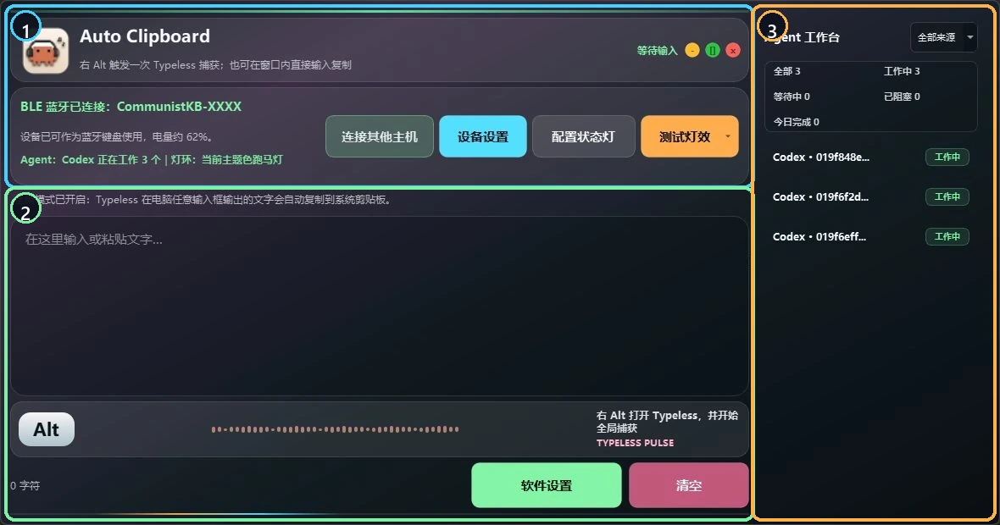
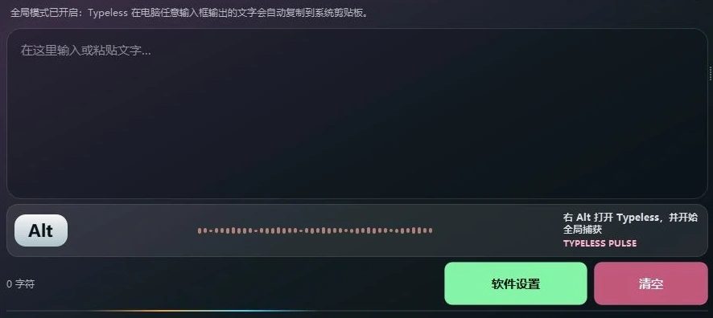
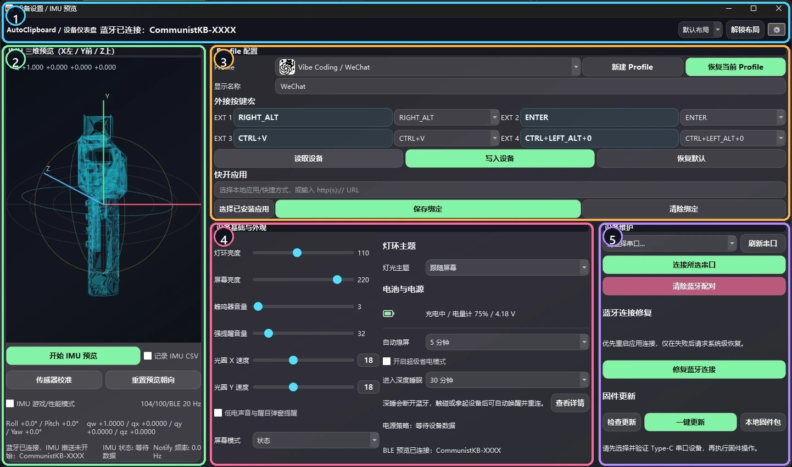
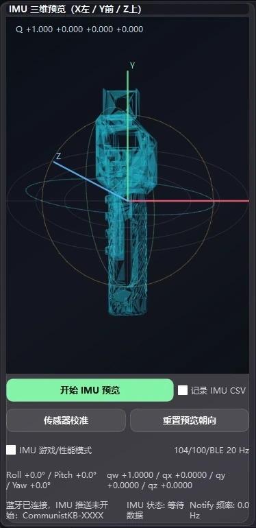
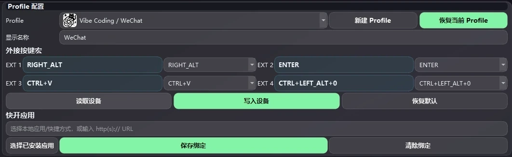
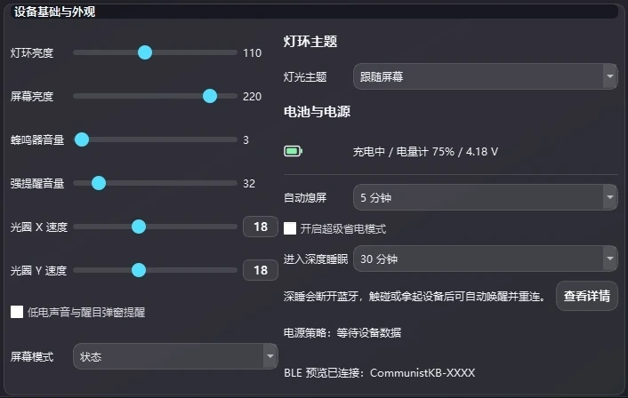
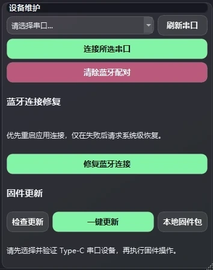

<!-- Generated from docs/software-interface-manual/README.bilingual.md by scripts/sync_readmes.py. Do not edit directly. -->

**简体中文** | [English](README.en.md) | [返回完整使用说明](../user-guide.zh-CN.md) | [返回仓库首页](../../README.md)

# AutoClipboard 软件界面详细说明书

这份说明书按照当前 AutoClipboard 的真实界面，逐块解释主窗口以及 **“设备设置 / IMU 预览”** 窗口。每一个控件都会明确说明：它是只查看状态、只修改电脑软件、会写入手柄硬件、只在本次连接中临时生效，还是涉及 Type-C 固件更新。

本文使用的都是实际软件截图。“设备设置”完整图来自真实设备连接界面；局部图只做编号标记和裁切，不会重绘、替换或伪造界面内容。

> 截图对应 AutoClipboard `0.3.49`。电量、Profile 名称、COM 端口、Agent 数量和蓝牙名称后缀会随用户设备变化。

## 先看懂“改动对象”标记

| 标记 | 含义 |
| --- | --- |
| **仅查看** | 只读取或显示状态，不修改设置。 |
| **软件** | 只修改 AutoClipboard 或当前电脑，不会写入手柄。 |
| **硬件** | 会向手柄发送配置命令；是否长期保留由固件的保存机制决定。 |
| **硬件临时会话** | 使用硬件数据或临时改变当前连接状态，断开后通常停止或恢复普通模式。 |
| **软件 + 硬件** | 先修改电脑端集成，AutoClipboard 运行时又会让手柄产生灯光、声音等反馈。 |
| **Type-C / 固件** | 通过 USB 串口识别设备或更新手柄固件，属于维护操作，不是普通偏好设置。 |

设备设置窗口中的控件并不都是“只在电脑上预览”。灯环亮度、屏幕亮度、蜂鸣器、灯光主题、电源策略、Profile 和宏按键都会向手柄发送命令；快开路径和演讲光圈速度则只保存在当前电脑。

## 1. 主窗口总览

  

| 编号 | 区域 | 主要作用 |
| --- | --- | --- |
| 1 | 设备与 Agent 状态区 | 显示蓝牙、电量、Agent 灯环同步情况，并提供 4 个快捷入口。 |
| 2 | 剪贴板与 Typeless 工作区 | 接收文字、自动复制、显示捕获状态，并提供软件设置。 |
| 3 | Agent 工作台 | 汇总 Codex、Claude 等任务及其当前状态。 |

主窗口本身主要是电脑端工作区。仅仅打开主窗口不会重写手柄配置；只有点击会发送信号的功能，或者进入设备设置后调整硬件项目，才会影响手柄。

## 2. 主窗口：设备状态与快捷操作区

  

| 界面项目 | 用途 | 改动对象 | 产生的效果 |
| --- | --- | --- | --- |
| 标题、副标题和“等待输入” | 标识当前软件，并显示文字捕获的工作状态。 | **仅查看** | Typeless 开始捕获、成功、重试或失败时，这里的状态会变化。 |
| `BLE 蓝牙已连接：CommunistKB-XXXX` | 显示 AutoClipboard 当前 BLE/GATT 会话连接到哪一把手柄。 | **仅查看** | 完整的 `CommunistKB-` 加真实 4 位后缀，可用于确认软件连接的是正确实体设备。 |
| 设备与电量提示 | 汇总蓝牙键盘是否可用，以及估算电量。 | **仅查看** | 帮助区分“系统已经能收到键盘宏”和“AutoClipboard 设备数据会话是否正常”。 |
| Agent 与灯环提示 | 显示聚合后的 Agent 状态，以及准备发送到灯环的效果。 | **仅查看 / 软件 + 硬件输出** | 例如存在工作中任务时，手柄可以显示当前主题色跑马灯。 |
| `连接其他主机` | 打开三主机槽位说明，并可继续进入 Windows 蓝牙设置。 | **软件入口 + 硬件配对** | 必须先在手柄 `Settings > BLE Hosts` 中选择 `EMPTY` 槽位，开启 120 秒配对窗口，新电脑才能发现手柄。 |
| `设备设置` | 打开下文的完整设备配置与 IMU 窗口。 | **仅打开不修改** | 真正的硬件改动发生在设备设置窗口内部。 |
| `配置状态灯` | 安装或修复 Codex `hooks.json` 与 Claude `settings.json` 中属于 AutoClipboard 的 Hook；执行前会提示并备份。 | **软件 + 硬件** | AutoClipboard 运行时可收集 Agent 生命周期，并把状态同步到手柄灯环。 |
| `测试灯效` | 向手柄临时发送一个选定的 Agent 状态。 | **硬件临时会话** | 可分别测试主题色慢呼吸、主题色跑马灯、黄色提醒、黄色快闪、红色告警、绿色完成呼吸和关闭；不会改变真实 Agent 任务。 |

`连接其他主机` 不会替用户生成或追加蓝牙后缀。系统中必须选择手柄实际广播的完整 `CommunistKB-XXXX` 名称。

## 3. 主窗口：剪贴板与 Typeless 工作区

  

| 界面项目 | 用途 | 改动对象 | 产生的效果 |
| --- | --- | --- | --- |
| 全局模式提示 | 说明 Typeless 在 Windows 其他输入框输出的文字是否会被捕获。 | **仅查看** | 关闭全局模式后，只有在 AutoClipboard 窗口内输入的文字会自动复制。 |
| 大文本输入框 | 接收键入或粘贴的文字，并提交到系统剪贴板。 | **软件** | 最新提交的文字可以在其他软件中直接粘贴。 |
| `Alt` 与 Typeless 脉冲面板 | 显示右 Alt 触发目前是等待、已武装、已捕获、超时还是不可用。 | **软件** | Windows 开启全局模式后，按一次右 Alt 会武装一次外部 Typeless 捕获。 |
| 字符数 | 显示当前编辑区文字长度。 | **仅查看** | 可用于确认一段长文本是否完整进入。 |
| `软件设置` | 打开当前电脑上的 AutoClipboard 偏好设置。 | **软件**；只有强提醒可进一步驱动硬件 | 具体项目见下表。 |
| `清空` | 清空当前编辑区。 | **软件** | 只删除可见文字，不会重置手柄，也不会清除蓝牙配对。 |

### “软件设置”具体会改什么

| 设置组 | 产生的效果 |
| --- | --- |
| 关闭窗口行为 | 选择后台挂起或直接退出。直接退出后，Agent 同步、Profile 快开、IMU 等后台服务都会停止。 |
| 开机自启动、窗口始终置顶 | 只改变 Windows 上的软件启动和窗口行为。 |
| 显示 Agent 状态面板 | 控制主窗口右侧工作台是否显示。 |
| Agent 完成强提醒 | Agent 完成时可让手柄蜂鸣并闪烁灯环，强提醒音量可以单独设置。 |
| 全局快捷键与全局模式 | 控制 Windows 级捕获以及右 Alt 触发 Typeless 的工作流。 |
| 模型用量查询 | 在当前电脑保存 New API/CCSwitch 查询方式，并把返回的用量显示到工作台。凭据只保存在本机。 |
| 系统语言 | 选择中文或 English 界面。 |
| 软件更新 | 下载并安装新版 AutoClipboard，只更新桌面软件，不会更新手柄固件。 |

## 4. Agent 工作台

  

| 界面项目 | 用途 | 改动对象 | 产生的效果 |
| --- | --- | --- | --- |
| 来源筛选 | 在全部来源、Codex、Claude 或其他已支持来源之间筛选。 | **软件** | 只改变工作台显示内容，不会修改 Agent 任务。 |
| 统计数字 | 显示全部、工作中、等待中、已阻塞和今日完成数量。 | **仅查看** | 快速了解当前工作负载。 |
| 任务行 | 显示缩短后的任务标识和归一化状态。 | **仅查看** | Hook/Bridge 收到新事件后会自动更新。 |
| 清理已完成任务（出现时） | 从当前工作台隐藏已完成记录。 | **软件** | 不会删除原始 Codex 或 Claude 对话。 |

配置状态灯集成后，这些归一化状态还能驱动手柄：空闲为慢呼吸、工作中为跑马灯、等待授权为黄色快闪、阻塞为红色告警、完成为绿色呼吸。

## 5. “设备设置 / IMU 预览”总览

  

| 编号 | 区域 | 主要作用 |
| --- | --- | --- |
| 1 | 连接状态与仪表盘布局 | 确认 BLE 设备；布局按钮只调整电脑端卡片排版。 |
| 2 | IMU 三维预览 | 显示姿态、记录数据、校准传感器，并控制临时性能模式。 |
| 3 | Profile、宏与快开 | 选择 Profile、配置 4 枚硬件宏，并绑定当前电脑的快开目标。 |
| 4 | 设备基础、外观与电源 | 调整硬件灯光、屏幕、声音、电源策略，以及电脑端演讲光圈速度。 |
| 5 | 设备维护 | 选择 Type-C 串口、修复软件 BLE 会话、清除配对和更新固件。 |

这个窗口把“只改软件”和“会写硬件”的项目放在了一起。使用 `写入设备`、清除配对、深度睡眠或固件按钮前，请先看下面对应说明。

## 6. 顶部连接状态与布局栏

  

| 界面项目 | 用途 | 改动对象 | 产生的效果 |
| --- | --- | --- | --- |
| 蓝牙连接文字 | 显示目前为设备状态和 IMU 数据提供来源的手柄。 | **仅查看** | 用于确认真实目标是正确的 `CommunistKB-XXXX`。 |
| `默认布局` 等布局选择器 | 切换已经保存的仪表盘排版。 | **软件** | 只改变当前电脑上的卡片位置。 |
| `解锁布局` | 允许移动、调整宽度、添加或隐藏卡片。 | **软件** | 不会修改固件，也不会改变实体手柄。 |
| 齿轮按钮 | 打开仪表盘或系统布局选项。 | **软件** | 用于管理界面排版，不是手柄配置按钮。 |

顶部 BLE 状态和右侧维护区的 Type-C 串口是两条不同连接。BLE 用于实时状态与配置；Type-C 用于串口身份确认和固件维护。

## 7. IMU 三维预览区

  

| 界面项目 | 用途 | 改动对象 | 产生的效果 |
| --- | --- | --- | --- |
| 四元数、三维模型、XYZ 轴、Roll/Pitch/Yaw 和频率 | 显示从手柄收到的姿态帧。 | **仅查看** | 三维模型会随手柄旋转，并显示帧率和通知是否健康。 |
| `开始 IMU 预览` | 启动 AutoClipboard 的 BLE IMU 订阅。 | **硬件临时会话** | 开始显示实时姿态；停止预览或会话断开后结束。 |
| `记录 IMU CSV` | 把收到的 IMU 帧写成电脑上的 CSV 日志。 | **软件** | 生成诊断文件，不会修改传感器。 |
| `传感器校准` | 向手柄发送 `imu:gyro-bias-calibrate`，约 5 秒内必须保持完全静止。 | **硬件** | 重新计算陀螺仪偏置，减少静止漂移；校准时移动反而可能让结果变差。 |
| `重置预览朝向` | 只重新定义电脑端三维模型的朝向参考。 | **软件** | 让模型朝向更方便观察，不会改变真实传感器轴，也不会重写固件校准。 |
| `IMU 游戏/性能模式` | 支持的 V3 设备使用更高的传感器、姿态和 BLE 推送频率。 | **硬件临时会话** | 预览更流畅；BLE 断开后设备自动回到普通模式。 |
| 底部诊断信息 | 显示欧拉角、四元数、BLE 目标、IMU 状态和 Notify 频率。 | **仅查看** | 用于判断连接是否存活、数据帧是否持续到达。 |

“传感器校准”和“重置预览朝向”不是同一件事：前者会改变手柄的传感器偏置，后者只改变当前电脑怎样画三维模型。

## 8. Profile、四枚外接按键宏与快开应用

  

### Profile 与四枚宏按键

| 界面项目 | 用途 | 改动对象 | 产生的效果 |
| --- | --- | --- | --- |
| Profile 选择器 | 选择当前查看和配置的 Profile。切换模式时还可能发送当前 `ai_mode`，并读取该 Profile 的宏。 | **硬件 + 查看** | 手柄小屏、图标/主题行为和 4 个宏槽会跟随所选 Profile。 |
| 显示名称 | 修改电脑端的显示名称覆盖。 | **软件**；除非后续进入明确的设备图标/写入流程 | 本机标签会改变；只编辑名称不会自动改写硬件名称。 |
| `新建 Profile` | 分配一个可用的自定义 Profile 槽位，并准备本地默认值。 | **软件草稿** | 还需要设置图标、宏，并执行对应写入或上传，手柄端才算完整配置。 |
| `恢复当前 Profile` | 加载内置默认值；连接设备时会发送屏幕模式、Profile 模式、主题模式和默认宏。 | **硬件** | 当前 Profile 会恢复为软件定义的默认配置。 |
| EXT1～EXT4 快捷键录制框和下拉框 | 定义 4 枚实体侧键的快捷键宏。只编辑输入框时，还不能说明手柄已经收到。 | **软件草稿** | 界面中的待写入值发生变化。 |
| `读取设备` | 请求 `macro:get`。 | **仅查看** | 用当前硬件 Profile 实际保存的宏覆盖界面显示值。 |
| `写入设备` | 发送 4 条 `macro:set`，随后读回核对。 | **硬件** | 当前 Profile 下的 4 枚实体侧键会执行新的快捷键。 |
| `恢复默认` | 对当前 Profile 发送 `macro:reset`。 | **硬件** | 立即恢复该 Profile 默认的 4 个宏。 |

### 快开应用

| 界面项目 | 用途 | 改动对象 | 产生的效果 |
| --- | --- | --- | --- |
| 路径或 URL 输入框 | 为当前 Profile 保存已安装应用、快捷方式、便携文件或 HTTP/HTTPS 网页。 | **软件** | 目标保存在当前电脑的 AutoClipboard 设置中，不写入 ESP32。 |
| `选择已安装应用` | 打开本机应用选择器。 | **软件** | 自动填写目标，并可更新本机 Profile 图标关联。 |
| `保存绑定` | 保存当前 Profile 的快开目标。 | **软件** | AutoClipboard 运行时，在手柄正常状态页单击波轮中键会打开这个目标。 |
| `清除绑定` | 删除当前电脑上的快开目标。 | **软件** | 该 Profile 在这台电脑上单击波轮中键将不会打开任何目标。 |

快开和硬件宏是两套独立功能：快开目标留在电脑上，EXT1～EXT4 映射则写入手柄。

## 9. 设备基础、外观与电源区

  

| 界面项目 | 用途 | 改动对象 | 产生的效果 |
| --- | --- | --- | --- |
| 灯环亮度 | 发送 `cfg:ring_brightness`。 | **硬件** | 改变正面灯环 LED 的亮度。 |
| 屏幕亮度 | 发送 `cfg:lcd_brightness`。 | **硬件** | 改变手柄彩色小屏背光亮度。 |
| 蜂鸣器音量 | 发送 `cfg:buzzer_volume`。 | **硬件** | 改变普通按键、切换和提示声音量。 |
| 强提醒音量 | 发送 `cfg:agent_alert_buzzer_volume`。 | **硬件** | 改变 Agent 完成强提醒所使用的蜂鸣器音量。 |
| 光圈 X / Y 速度 | 在 AutoClipboard 中保存演讲光圈两条轴的灵敏度。 | **软件** | 改变电脑屏幕上光圈水平、垂直移动速度，不会修改 IMU 传感器。 |
| 低电声音与醒目弹窗提醒 | 发送低电提醒开关。 | **硬件** | 开启或关闭手柄更明显的低电反馈。 |
| 屏幕模式 | 发送状态、精简或关闭背光模式。 | **硬件** | 改变小屏显示信息量，或关闭背光。 |
| 灯光主题 | 发送跟随屏幕、预设色或自定义颜色。 | **硬件** | 改变灯环日常效果使用的基础主题；为保证警告清楚，Agent 告警色可能临时覆盖主题色。 |
| 电池与电压 | 显示实时电源信息。 | **仅查看** | 用于判断是否正在充电，以及电压是否合理。 |
| 自动熄屏 | 发送待机熄屏时间。 | **硬件** | 空闲达到设定时间后关闭屏幕，但设备仍可保持普通连接。 |
| 超级省电 / 深度睡眠 | 发送深睡开关和时间。 | **硬件** | 长时间空闲后断开蓝牙；触碰或移动可唤醒，但睡眠期间无法收到新的 Agent 提醒。 |
| 卡片底部的屏幕模式 | 与上面的硬件屏幕模式是同一类配置，只是布局展示位置不同。 | **硬件** | 在状态、精简和关闭背光之间切换。 |

电源策略要求：非零熄屏时间必须早于深度睡眠时间。旧固件如果不支持电源策略，这些控件会保持禁用，直到更新为兼容的 V3 固件。

## 10. 设备维护、蓝牙修复与固件更新区

  

| 界面项目 | 用途 | 改动对象 | 产生的效果与注意事项 |
| --- | --- | --- | --- |
| 串口选择器 | 选择 CH343/WCH 对应的 Type-C 数据串口。 | **仅选择 / 查看** | 只有充电功能的线不会提供可用 COM 端口。 |
| `刷新串口` | 重新枚举当前电脑上的串口。 | **软件** | 新插入的设备可以出现在列表中。 |
| `连接所选串口` | 打开所选串口并验证设备身份和状态。 | **Type-C 会话** | 为串口诊断和受保护的固件流程做准备；仅连接不会自动刷固件。 |
| `清除蓝牙配对` | 向手柄发送经过确认的清配对命令。 | **硬件，会删除配对记录** | 已保存蓝牙密钥会被移除，电脑需要重新配对。普通重连变慢时，不要把它当成第一步。 |
| 蓝牙连接修复状态 | 显示当前重连阶段和最近一次设备活动。 | **仅查看** | 用于区分“软件会话卡住”和“设备完全没有数据”。 |
| `修复蓝牙连接` | 优先重启 AutoClipboard 的 BLE/GATT 会话；只有失败后才请求更广泛的系统恢复。 | **软件 / 连接会话** | 尝试恢复状态和 IMU 通信，不会主动清除配对。 |
| `检查更新` | 在已确认设备身份后查询发布源并比较固件版本。 | **仅查看 / 联网** | 告诉用户是否存在兼容的新固件包。 |
| `一键更新` | 通过 Type-C 下载、校验、刷写并再次验证兼容固件。 | **Type-C / 固件** | 会替换手柄固件。必须确认实体设备正确、使用数据线，并保证供电不中断。 |
| `本地固件包` | 选择本地包进入受保护的刷写流程。 | **Type-C / 固件** | 主要用于恢复或受控测试；选择错误板型的包可能导致设备无法正常启动。 |

这里的固件更新和“软件设置”里的软件更新不是一回事：软件更新替换 Windows 上的 AutoClipboard；维护区更新的是手柄固件。

## 11. 推荐的安全操作顺序

1. 先确认完整蓝牙名称和各项只读状态，确定软件连接的是正确手柄。
2. 修改 Profile 时，先选 Profile，再点 `读取设备`；编辑 4 个宏后点 `写入设备`，最后在安全的纯文本编辑器里逐个测试实体按键。
3. 快开目标要单独保存，并记住它只存在于当前电脑，使用时 AutoClipboard 必须在后台运行。
4. 灯光、声音、屏幕和主题最好一次只改一组，方便立即观察实体效果是否符合预期。
5. 传感器校准时保持手柄静止。如果只是模型显示方向不方便，应使用“重置预览朝向”，不要重复做硬件校准。
6. 蓝牙异常时先用 `修复蓝牙连接`，不要一上来就清除配对。
7. 只有选择并验证正确的 Type-C 串口设备后，才进入固件操作。

蓝牙配对、波轮操作、硬件接口、Skill 安装和完整故障排查，请返回[完整中文使用说明书](../user-guide.zh-CN.md)。
