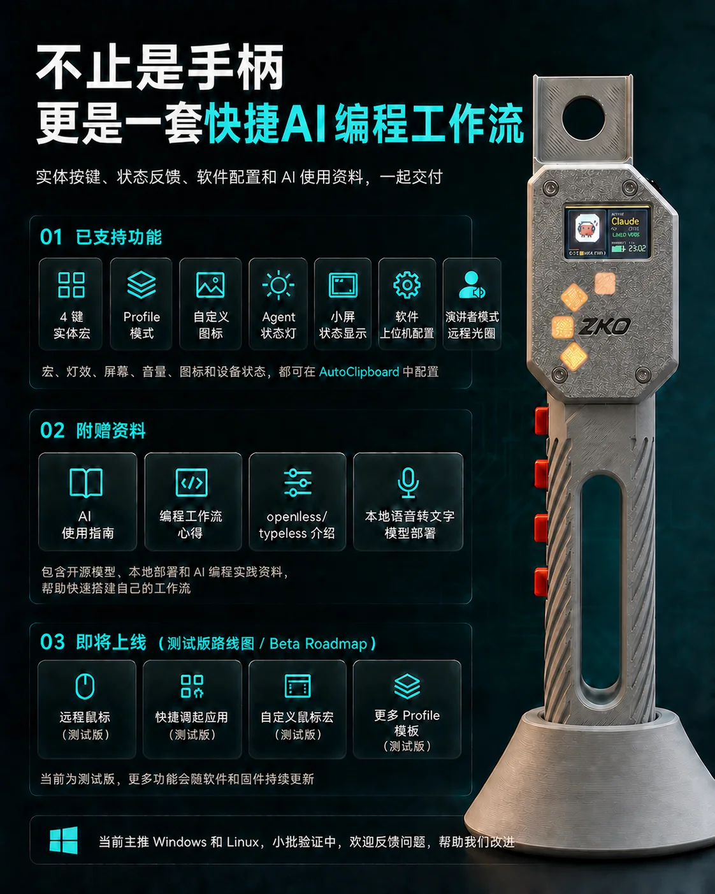
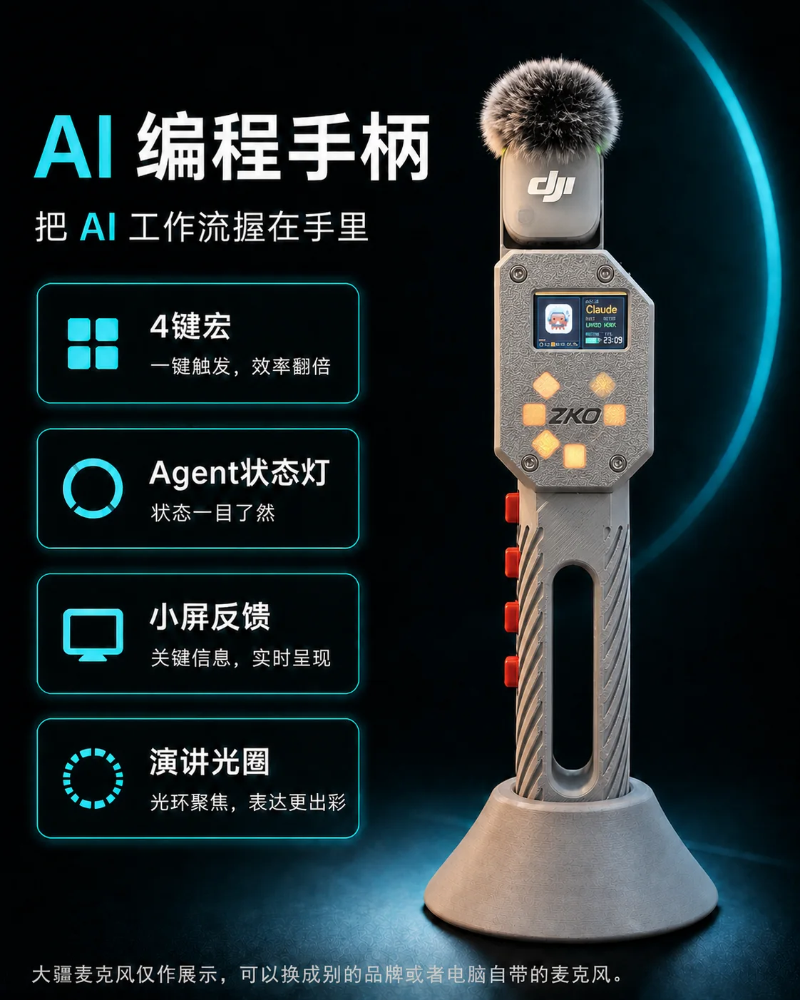
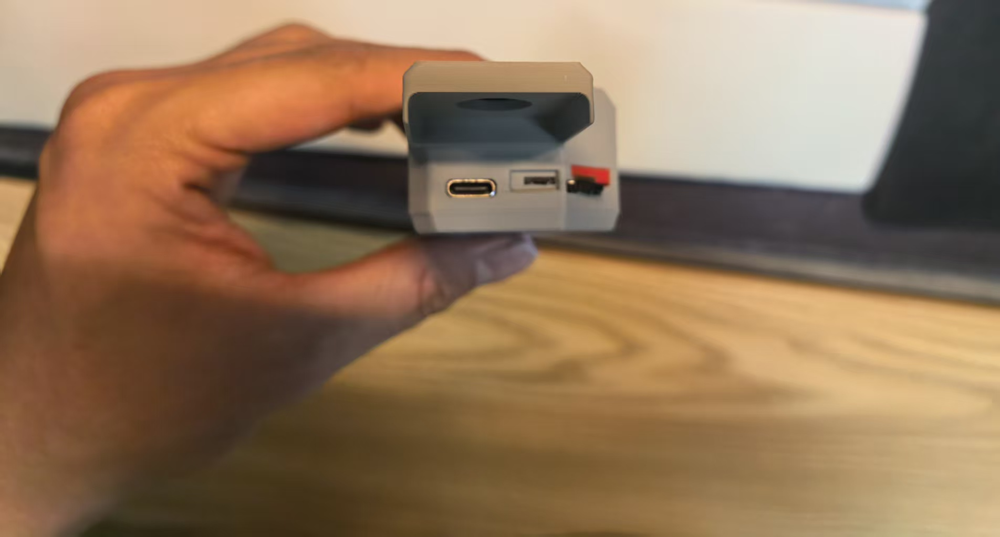
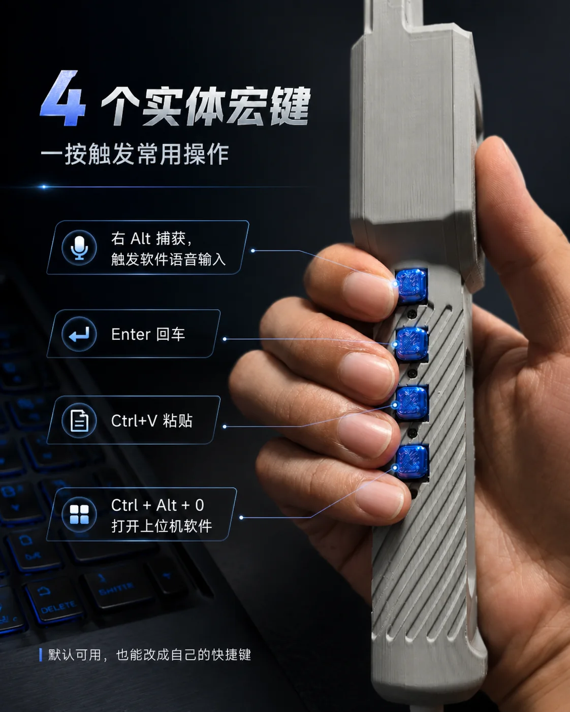
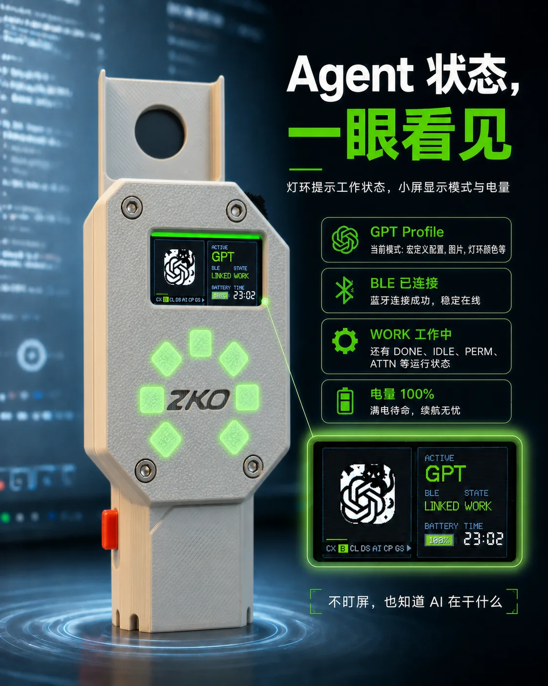
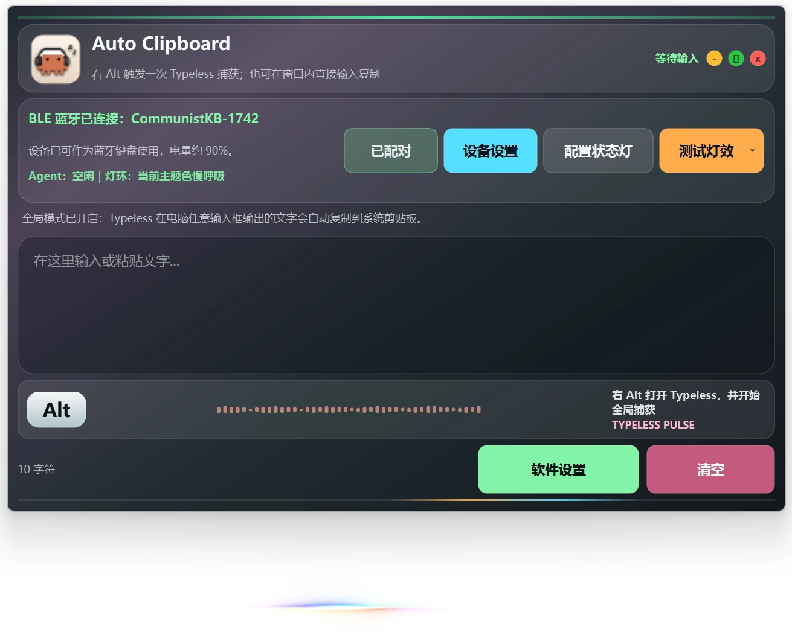
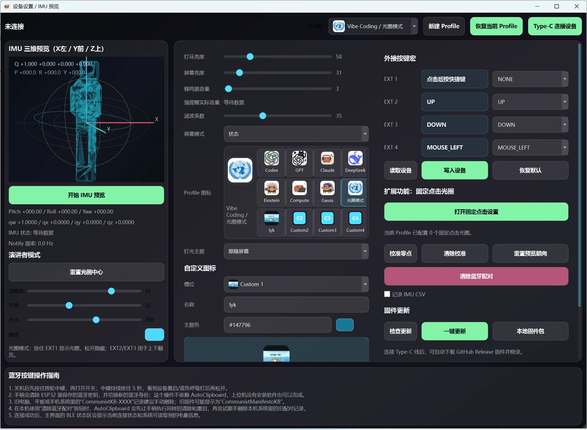

<!-- Generated from docs/user-guide.bilingual.md by scripts/sync_readmes.py. Do not edit directly. -->

[简体中文](user-guide.zh-CN.md) | **English** | [Back to repository](../README.en.md)

# ZKO AI Coding Handle User Guide

This guide is written for users who have never used the handle, AutoClipboard, Agent Skills, or the screen controls before. Follow the chapters in order for the first setup; use the troubleshooting chapter later when a specific symptom appears.

<p align="center">
  
</p>

## Recommended reading order

1. Install the AI Coding Handle Skill.
2. Identify the hardware and USB Type-C port.
3. Pair `CommunistKB-XXXX` over Bluetooth.
4. Learn the wheel, middle button, Profiles, and macro buttons.
5. Start AutoClipboard and configure Agent status synchronization.
6. Use troubleshooting only when a step does not work as described.

> The product and application continue to evolve. Promotional images and screenshots help identify the hardware and workflow, while the written commands and state labels in this guide are the authoritative instructions for the current release.

## 1. Choose an installation path

There are two supported ways to start.

### Recommended: let a coding agent use the Skill

Choose this path when Codex, Claude Code, OpenCode, or another Agent Skills-compatible client is available. The Skill can select the correct application release, inspect the installed application, identify the connected board, configure supported Agent hooks, and collect structured diagnostic evidence.

### Manual setup

Choose this path when no compatible agent client is available:

1. Open the [latest Release](https://github.com/Lijinzh/Communist-Manifesto-Releases/releases/latest).
2. Download the installer for the current operating system.
3. Install AutoClipboard.
4. Pair the handle in the operating system's Bluetooth settings.
5. Start AutoClipboard and follow the remaining chapters.

Windows is the primary supported platform. Linux support is experimental. Use a macOS package only when the selected release explicitly contains one.

## 2. Install and use the AI Coding Handle Skill

Install the repository Skill with the cross-agent installer:

```bash
npx skills add Lijinzh/Communist-Manifesto-Releases --skill ai-coding-handle -g
```

To see the Skill detected by the installer before installing:

```bash
npx skills add Lijinzh/Communist-Manifesto-Releases --list
```

After installation, a useful first request is:

> Use the `ai-coding-handle` Skill. Install or verify AutoClipboard, identify my connected ZKO handle, and run read-only USB, serial, Bluetooth, application, and Agent Hook diagnostics. Do not reset Bluetooth or update firmware without asking me first.

### What the Skill can help with

- Select and install the appropriate published AutoClipboard package.
- Check the application version and supported Agent Bridge capabilities.
- Identify a D4 or V3 device from structured device information.
- Inspect USB serial, Bluetooth, AutoClipboard runtime, and Agent Hook status.
- Explain why a device is paired but not available to AutoClipboard.
- Check whether a matching published firmware update exists.

### Actions that still require confirmation

- Installing or replacing software when it changes the computer.
- Running a live device-state test that changes visible lights or screen state.
- Resetting the operating system's Bluetooth adapter or pairing records.
- Flashing firmware. The exact device, version, package, plan, and digest must be shown before a separate confirmation.

The Skill is a guided diagnostic and maintenance tool, not permission to perform destructive recovery automatically.

## 3. Hardware overview

<p align="center">
  
</p>

> The DJI microphone in the image is an example accessory and is not included. The handle can be used without that microphone.

### Main parts

| Part | What the user sees | What it does |
| --- | --- | --- |
| Color screen | Small display near the top | Shows Profile, Bluetooth, battery, time, Agent state, and device messages |
| Wheel | Black wheel on the upper side | Switches Profile or moves through menu items |
| Wheel middle button | Pressable center of the wheel | Quick launch, enter Settings, confirm, go back, or exit depending on the screen |
| Four macro buttons | Four side buttons under the user's fingers | Sends the four macros stored in the current Profile |
| Front light ring | Illuminated front elements | Shows Agent, Profile, input, completion, and warning feedback |
| IMU | Motion sensor inside the handle | Supplies orientation data for preview and the presenter Halo |
| USB Type-C | Connector shown in the next photo | Charges the handle and provides serial diagnostics and firmware update transport |

<p align="center">
  
</p>

The USB Type-C connector is the leftmost connector visible in the photograph. It is the documented user connection for charging and computer data. The exposed components beside it are not required for the normal setup steps in this guide.

## 4. Charging and USB Type-C connection

### Charging

1. Connect a suitable USB Type-C cable to the handle.
2. Connect the other end to a stable USB power source or computer.
3. Check the handle screen or AutoClipboard battery status when available.

### Data connection

Use a cable that supports data when you need any of the following:

- A Windows COM port and serial diagnostics.
- Device identity or board information over Type-C.
- Large icon transfer.
- Firmware update.

A charge-only cable can provide power but will not create a COM port. If Windows does not recognize the serial device even with a known data cable, install the signed [CH343 driver](ch343-driver-installation.md).

Bluetooth and Type-C are independent. Normal Bluetooth keyboard macros do not require a Type-C cable, and connecting or disconnecting Type-C should not be treated as proof that Bluetooth is connected.

## 5. Bluetooth name, first pairing, and three host slots

### Find the correct device name

The handle advertises this pattern:

```text
CommunistKB-XXXX
```

- `CommunistKB-` is the fixed prefix.
- `XXXX` is a four-character uppercase hexadecimal short ID generated from the last two bytes of the ESP32 MAC address.
- A real device may therefore appear as `CommunistKB-A216` or another four-character value.
- The full name is already broadcast by the handle. Do not type or append a suffix manually.

### Screen Bluetooth states

| State | Meaning | What to do |
| --- | --- | --- |
| `PAIR` | The handle is temporarily discoverable | Add `CommunistKB-XXXX` in system Bluetooth settings |
| `WAIT` | The handle is waiting for the selected saved host | Wake or enable Bluetooth on that computer |
| `LINK` | The selected host is connected | Test a macro button or start AutoClipboard |

### First pairing

1. A new device, or a device after all pairing records are cleared, opens one 120-second pairing window.
2. Open the computer's Bluetooth settings.
3. Choose **Add Bluetooth device**.
4. Wait until the handle screen shows `PAIR`.
5. Select the complete `CommunistKB-XXXX` entry.
6. After pairing, wait for the screen to show `LINK`.
7. Press the `Enter` or `Ctrl+V` macro in a safe text field to confirm Bluetooth HID input.

If the 120-second window expires, open another pairing window from `Settings > BLE Hosts` as described below.

### Pair a second or third computer

1. On the handle status screen, double-click the wheel middle button.
2. Rotate to `BLE Hosts` and single-click.
3. The page shows three slots. `*` marks the currently selected slot.
4. Select an `EMPTY` slot and single-click it.
5. Wait for `PAIR` and the blue breathing feedback.
6. Add `CommunistKB-XXXX` on the new computer within 120 seconds.

### Switch or delete a saved host

- Single-click a saved slot: select that host and allow it to reconnect.
- Long-press a saved slot: delete the Bluetooth bond and stored record for that slot.
- Select `Back` and single-click: return to the previous menu.
- Holding the wheel middle button for about five seconds during startup clears all three slots and restarts the handle. This is a recovery action, not the normal way to switch computers.

Do not hold the middle button while rotating the wheel. The handle's physical mechanism does not support that gesture.

## 6. Wheel, middle button, and Settings

The same control has different meanings on the normal status screen and inside Settings.

### Normal status screen

| Gesture | Result |
| --- | --- |
| Rotate upward | Previous Profile |
| Rotate downward | Next Profile |
| Single-click | Publish the quick-launch event for the current Profile |
| Double-click | Enter `Settings` |
| Long-press | Enter `Settings` |

Single-click quick launch works only when AutoClipboard is running and the current Profile has an application, shortcut, or HTTP/HTTPS URL assigned.

### Settings and sub-pages

| Gesture | Result |
| --- | --- |
| Rotate upward or downward | Move the selection; adjust the current value while editing |
| Single-click | Open an item, start editing, confirm, or save |
| Long-press | Cancel the current edit, return to the previous page, or exit Settings |

### Main Settings items

| Item | Purpose |
| --- | --- |
| `LCD Bright` | Screen backlight brightness |
| `Ring Bright` | Front light ring brightness |
| `Buzzer Vol` | Buzzer volume |
| `Screen Mode` | Status, compact, or backlight-off mode |
| `IMU Stream` | Enable or disable BLE IMU notifications |
| `BLE Hosts` | View, pair, switch, or delete one of three host slots |
| `Diagnostics` | View connection, IMU, battery, and button summaries |
| `Reset Settings` | Restore device settings; it does not clear Bluetooth pairing records |

## 7. Profiles and four macro buttons

<p align="center">
  
</p>

Each Profile stores its own four macro slots, display name, icon, and visual theme. AutoClipboard can also associate a desktop quick-launch target and fixed-click coordinates with each Profile.

### Default Vibe Coding macros

| Button | Default macro | Typical use |
| --- | --- | --- |
| EXT1 | `Right Alt` | Trigger Typeless or voice-input capture |
| EXT2 | `Enter` | Confirm, send, or insert a newline |
| EXT3 | `Ctrl+V` | Paste the current clipboard |
| EXT4 | `Ctrl+Alt+0` | User-defined application action |

### Available Profiles

The current firmware provides eight built-in Profiles—`Codex`, `GPT`, `Claude`, `DeepSeek`, `Einstein`, `Compute`, `Gauss`, and `Halo`—plus `Custom 1` through `Custom 4`.

Rotate the wheel on the normal screen to change Profile. A sound and light animation confirm the change. Names, icons, and macros can be written to the handle; computer-specific paths, URLs, and fixed screen coordinates remain in AutoClipboard on that computer.

### Halo presenter Profile

- Hold EXT1 to show the presenter Halo; release EXT1 to hide it.
- EXT2 and EXT3 are used for previous and next page by default.
- Move the handle to control the Halo while the IMU stream and AutoClipboard presenter monitor are active.

## 8. Screen, light ring, and Agent state

<p align="center">
  
</p>

The screen can show:

- Current Profile name and icon.
- Bluetooth state: `LINK`, `WAIT`, or `PAIR`.
- Battery percentage, charging or power information, and time.
- Input, recording, device, and diagnostic messages.
- A top-right badge containing the number of currently working Agents. The badge disappears when the count is zero or the status expires.

The top-right number is an Agent count, not a Bluetooth host-slot number. Host slots are shown only in `Settings > BLE Hosts`.

Agent state examples include idle, working, attention, permission, blocked, done, and closed. AutoClipboard aggregates supported Agent lifecycle events and relays the state over BLE to the handle. Without AutoClipboard and a configured Hook/Bridge, the normal Bluetooth keyboard macros can still work, but Agent state will not update.

## 9. Use AutoClipboard

### Main window

<p align="center">
  
</p>

The main window shows the Bluetooth device name, connection summary, battery information, Agent state, Typeless capture status, and shortcuts to device settings or light tests.

### Device settings

<p align="center">
  
</p>

The device settings window can provide:

- Profile selection, creation, renaming, icon configuration, and macro recording.
- Screen brightness and mode, light-ring brightness and theme, and buzzer volume.
- Battery, power, BLE, and device status.
- IMU three-dimensional preview, calibration, recording, and presenter Halo controls.
- Type-C device selection, serial diagnostics, Bluetooth repair entry points, and firmware maintenance.

Screenshots are illustrative; labels and layout may move as releases improve.

### Understand the two Bluetooth layers

1. **Bluetooth HID keyboard:** the operating system receives macro-key keyboard input. This can remain connected when AutoClipboard is closed.
2. **AutoClipboard BLE/GATT session:** the application receives status and IMU data and sends configuration. This requires AutoClipboard to be running and attached to the same physical handle.

It is therefore possible for macro buttons to type correctly while AutoClipboard is not yet ready. That symptom does not mean the Bluetooth keyboard pairing failed.

## 10. Configure Agent status synchronization

Basic macros require only the operating system Bluetooth keyboard connection. Agent status requires all of the following:

1. AutoClipboard is installed and running.
2. The correct `CommunistKB-XXXX` handle is paired and available to AutoClipboard.
3. The Agent has a supported lifecycle Hook or Bridge configuration.
4. The Hook writes valid local state events.
5. AutoClipboard aggregates those events and relays the current state to the handle.

The Skill is the recommended way to configure and verify this chain. Manual helpers are also available:

- [Agent status setup guide](agent-signal-setup.md)
- [`configure-agent-signal-windows.ps1`](../scripts/configure-agent-signal-windows.ps1)
- [`configure-agent-signal-linux.sh`](../scripts/configure-agent-signal-linux.sh)

After configuration, keep AutoClipboard running in the background. A working macro key alone does not prove that the Agent Hook is configured.

## 11. Firmware updates

V3 is the currently maintained hardware revision. Firmware packages are board-specific; never flash a package intended for another revision.

### Recommended update flow

1. Connect the handle with a data-capable USB Type-C cable.
2. Ensure Windows exposes the correct COM port; install the CH343 driver if necessary.
3. Use AutoClipboard or the Skill to identify the live board and device serial number.
4. Run a firmware check before any write.
5. Review the proposed version, package, device identity, update plan, and validation result.
6. Give a fresh explicit confirmation only when all information matches the physical device.

Normal application-only firmware updates preserve NVS settings and custom icons when performed through the validated workflow. Do not use an unrelated board package, erase the entire device, or bypass identity validation as a routine fix.

## 12. Troubleshooting

### The Bluetooth device is not visible

1. Wake or power on the handle.
2. Check whether the screen shows `WAIT` instead of `PAIR`.
3. Double-click the wheel, open `Settings > BLE Hosts`, choose `EMPTY`, and single-click.
4. Wait for `PAIR` before scanning again.
5. Keep the computer close to the handle and temporarily stop scanning from other nearby computers.
6. If all three slots are occupied, delete one saved slot only after confirming which host record is no longer needed.

### The device is paired, but macro buttons do not type

1. Confirm the screen shows `LINK`.
2. Test inside a safe plain-text editor.
3. Switch to a Profile whose macros are known, such as the default Vibe Coding Profile.
4. Verify the target application accepts `Enter`, `Ctrl+V`, or the configured shortcut.
5. Ask the Skill to inspect the real device identity and Bluetooth state before deleting pairings.

### Macro buttons work, but AutoClipboard says disconnected

The HID keyboard layer and the AutoClipboard GATT session are separate.

1. Start or restart AutoClipboard.
2. Keep the handle awake and close to the computer.
3. Confirm AutoClipboard is targeting the same `CommunistKB-XXXX` name.
4. Run the Skill's read-only inventory and doctor checks.
5. Do not repeatedly remove the Windows Bluetooth device merely because the application session is not ready.

### Type-C is connected, but there is no COM port

1. Replace the cable with a known data-capable cable.
2. Try another direct USB port instead of a hub.
3. Open Windows Device Manager and check for an unknown or CH343/WCH serial device.
4. Follow the [CH343 driver installation and troubleshooting guide](ch343-driver-installation.md).
5. Reconnect the handle and reopen AutoClipboard device settings.

### Agent status does not appear

1. Confirm AutoClipboard is running.
2. Confirm the handle is available to the application, not only paired as a keyboard.
3. Run Agent Bridge doctor through the Skill.
4. Review and approve supported Hook configuration when the agent client requires user trust.
5. Generate a real Agent lifecycle event and check whether the screen or light ring changes.

### Profile single-click does not open anything

1. Confirm this is a single-click on the normal status screen, not inside Settings.
2. Confirm AutoClipboard is running.
3. Assign an application, shortcut, or HTTP/HTTPS URL to the current Profile.
4. Single-click again and verify the target still exists on the current computer.

### The handle sleeps or disconnects after inactivity

The device may use screen timeout or Deep Sleep. Move or pick up the handle to wake it. Deep Sleep temporarily disconnects Bluetooth and then reconnects to the selected saved host after wake. It does not delete pairing records.

### Recommended request to an agent

> Use the `ai-coding-handle` Skill to diagnose my handle. First identify the real device, Bluetooth name, board revision, AutoClipboard version, serial availability, and Agent Hook status. Keep the diagnosis read-only. Explain the failing layer before asking me to reset pairing, reset Bluetooth, or update firmware.

## 13. Information to include when requesting help

Providing precise information avoids destructive guesswork. Include:

- Operating system and version.
- Complete Bluetooth name, such as `CommunistKB-A216`.
- What the handle screen shows: `LINK`, `WAIT`, or `PAIR`.
- Whether macro buttons type in a plain-text editor.
- Whether AutoClipboard shows the same device name.
- AutoClipboard version.
- Board revision and firmware version, when available.
- Whether a Type-C COM port is present.
- The exact step that failed and any screenshot of that step.

Do not publish private logs, credentials, account tokens, or unrelated personal information.

## Related documents

- [Repository home and quick start](../README.en.md)
- [Agent status setup](agent-signal-setup.md)
- [Windows CH343 driver guide](ch343-driver-installation.md)
- [AI Coding Handle Skill](../skills/ai-coding-handle)
- [Product introduction website](https://shenqiqishi.github.io/zko_page/)
